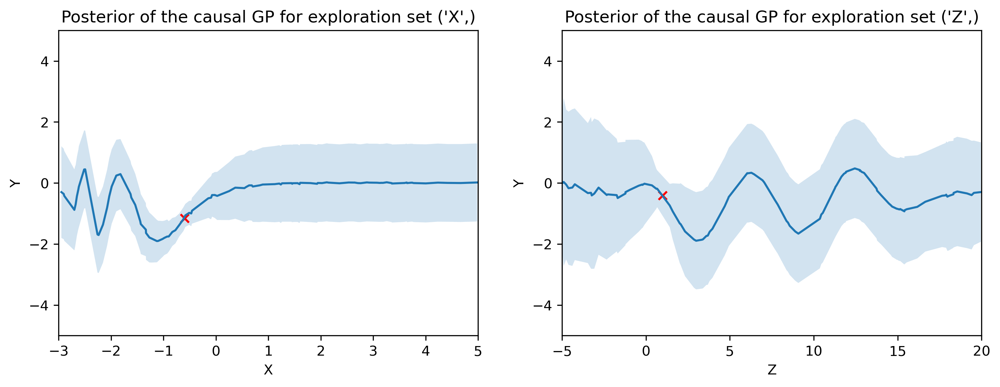

# 2025_TimeSeries_RL_Internship

## Overview
This repository contains the implementation of the Dynamic Causal Bayesian Optimization (DCBO) method as proposed by Aglietti et al. It leverages the TensorFlow Probability framework for conducting analyses. The repository is structured as follows:

- `causal_graph/`: Contains methods for generating and processing causal graphs.
- `demo/`: Contains demonstrations of question 1 and synthetic experiments.
- `methods/`: Implementation of the dynamic causal Bayesian optimization method.
- `sem/`: Includes implementations of various structural equation models.
- `tests/`: Contains unit and integration tests to ensure the reliability of the code.
- `utils/`: Useful functions for data processing in the context of the DCBO method.
- `Report_Dynamic_Causal_Bayesian_Optimization.pdf`: Discusses the implementation of the DCBO method.

## Demonstrations

We offer three demonstrations to illustrate the capabilities of our implementation:

* **Demo 1. Exploration set identification:** Demonstrates how to find an exploration set for a given causal graph and target variable.
* **Demo 2a. Stationary DAG and SCM experiment replication:** Replicates the first experiment in the paper, where a stationary DAG and SCM are used to evaluate the DCBO method.
* **Demo 2b. Noisy manipulative variables:** Demonstrates the DCBO method's performance when the noise level of variables is increased.

Below is an animation that provides a quick overview of how DCBO operates:

## Prerequisites
- Python 3.x
